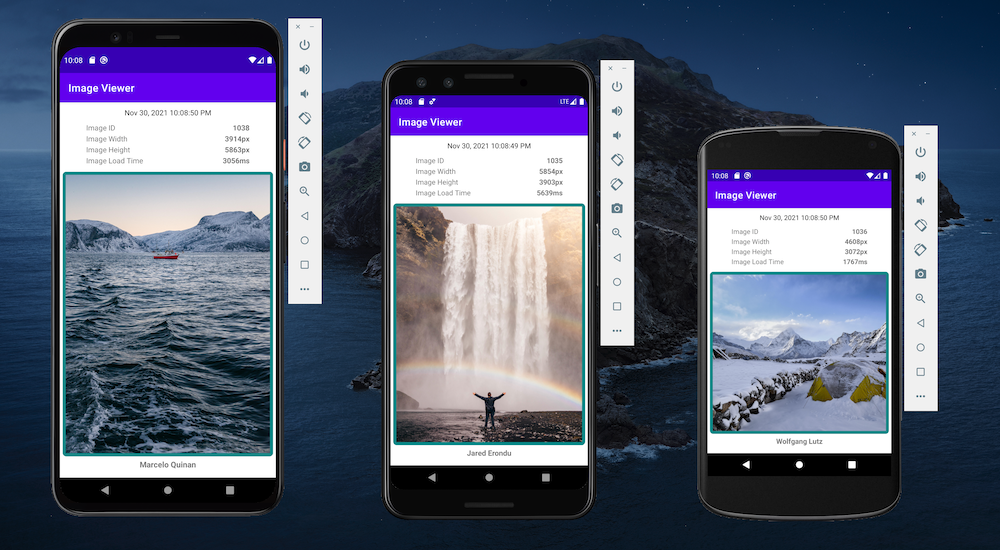

This app is designed using android Jetpack architecture guidelines: https://developer.android.com/jetpack/guide

External libraries used:
- Retrofit/Moshi for REST api communication
- Glide for image loading

To run the app simply clone the repo then open in android studio and run in emulator or build apk to install on device

